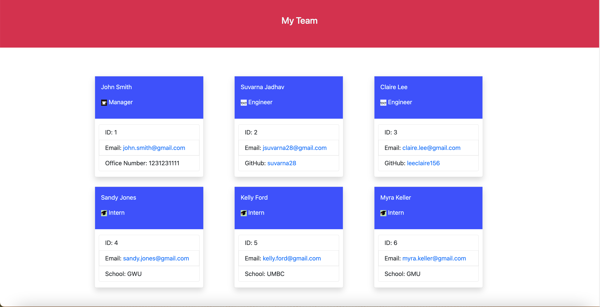

# team-profile-generator

## Description 

This is a Node.js command-line application that takes in information about employees on a software engineering team, then generates an HTML webpage that displays summaries for each person.

The application can be invoked by using 'node index.js' command. 

* Once invoked it will ask you a series of question to enter name, id, email, office number and a multiple choice question to add an engineer or an intern or to finish building your team. The first employee is a manager who creates the rest of the team. The last question in 
* If you select engineer, it will ask you to enter name, id, email, github username of the engineer and at the last it will again ask the same multiple choice question to add an engineer or an intern or to finish building your team.
* If you select intern, it will ask you to enter name, id, email, school of the intern and at the last it will again ask the same multiple choice question to add an engineer or an intern or to finish building the team.
* When you select 'finish building your team', the application exists with a 'Team built successfully!' message and an index.html file is created with summaries of each entered employee. 

## Features

* You have to enter a number for employee ID, if you do not enter a number then it will give you an error saying "Please enter a number".
* If you enter an already entered number for ID, then it will give you an error saying "ID already taken, please enter a new ID", this ensures that each employee is assigned with an unique ID. 

## Installation

N/A

## Screenshot

## Link to the GitHub repo of the application

## Link to the walkthrough video demonstrating the functionality of the application

## Credits

* Our TA, Sebastian for answering homework related doubts. 
* Stackoverflow for 'validate' in prompt inquirer and also for learning how to write to an already existing file. 
